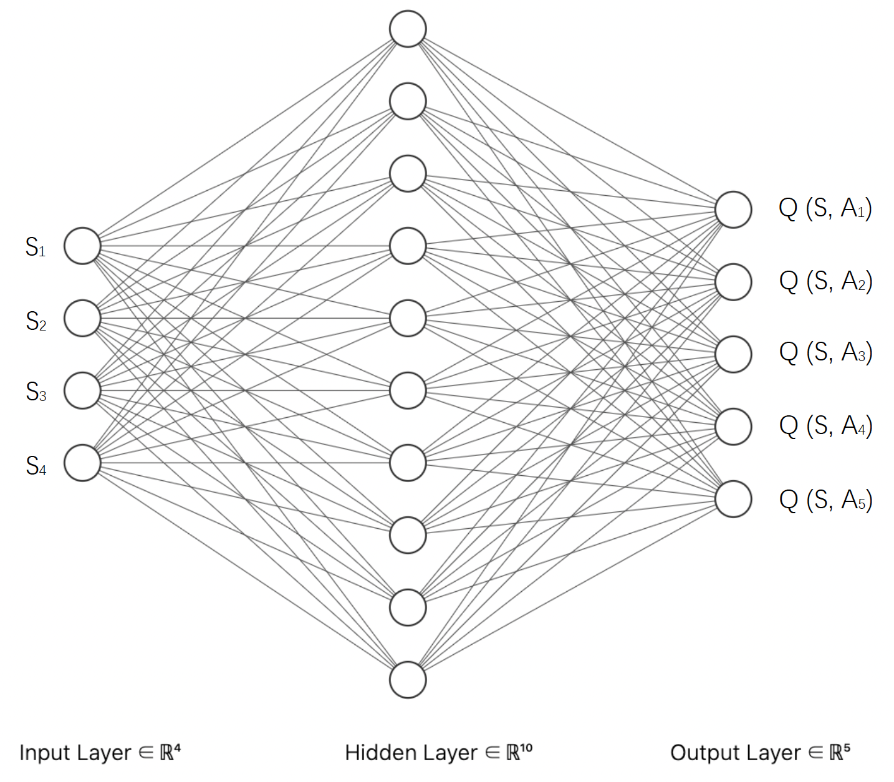

# CPEN502-project

* <u>CPEN 502</u>: Architecture for Learning System

* Robot battle tank development based on reinforcement learning and robocode

## Network Structure

* Inputs: the states of the robot
* Outputs: the Q-values of all the actions under the state S

## Data Preprocessing for Look Up Table and Neural Network

| Data               | Original Range  | Quantization for Look Up Table | Scaling for NN |
| ------------------ | --------------- | ------------------------------ | -------------- |
| my energy          | [0, around 100] | 0, 1, 2                        | [0, 1]         |
| distance to enemy  | [0, 1000]       | 0, 1, 2                        | [0, 1]         |
| enemy's energy     | [0, around 100] | 0, 1, 2                        | [0, 1]         |
| distance to center | [0, 1000]       | 0, 1, 2                        | [0, 1]         |
| action             | NA              | 0, 1, 2, 3, 4                  | NA             |

